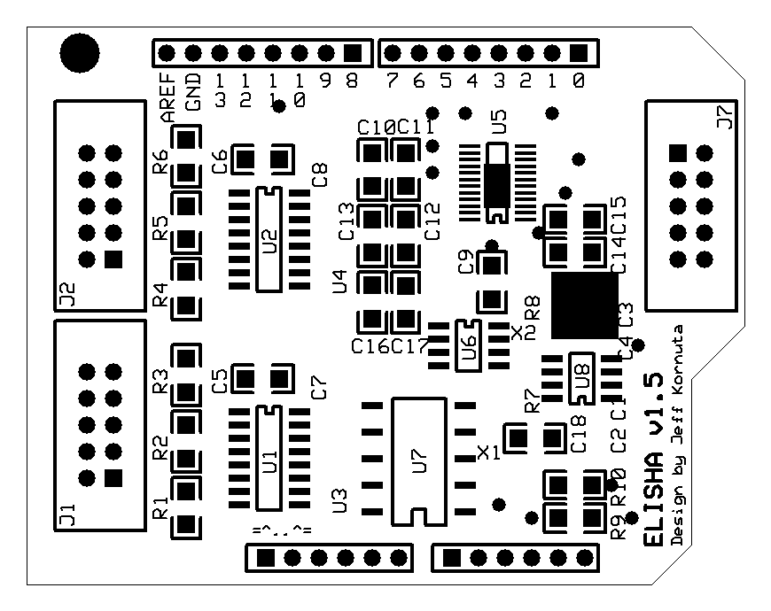

##Elisha-EVPS

Libraries and code for the Digilent chipKit Uno32 to interface with a daughter board that controls an ex-vivo vascular perfusion system (EVPS), also known as the ex-vivo lymphatic perfusion system (ELPS).

* * *

###Main files and folders:

 - `Master_1/Master_1.pde`: Main code compiled by MPIDE and uploaded to the Uno32.
 - `masterSerial.py`: Main Python program used by the host PC to communicate with and operate the Uno32.
 - `libraries/`: Various C++ libraries that may be used by `Master_1.pde`; check the header to see which ones are used.
 - `Schematics and Boards/`: Schematics and PCB traces for both the main daughter board (ELISHA: ELectronic Interfacing System Hub and Actuator) and the ViX 250AH interfacing board.
 
* * *

